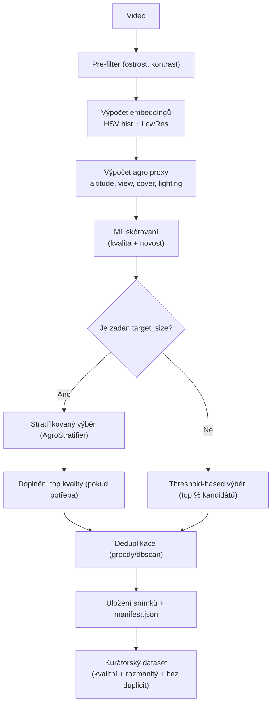

# Balanced Frame Extractor for Agro ML Datasets

Extract balanced frames from video to create a dataset for ML training.

Tato aplikace slouží k automatické kuraci snímků z droních videí v agro doméně. Cílem je připravit dataset vhodný pro trénování modelů počítačového vidění — tedy kvalitní, rozmanitý a bez duplicit. Skript provádí pre-filtraci podle kvality snímků, spočítá embeddingy a agro-proxy (výška letu, úhel pohledu, vegetační pokryv, světelné podmínky), skóruje snímky pomocí ML logiky, provede stratifikovaný výběr nebo threshold-based výběr a nakonec deduplikaci. Výstupem je složka s vybranými snímky a manifest (`manifest.json`) s metadaty.

---

## Shrnutí flow (odpovídá implementaci ve `balanced_frame_extractor.py`)

1. Prefilter snímků (ostrost, kontrast, stride)
2. Výpočet metrik kvality (exposure, noise) a embeddingů (HSV hist + lowres)
3. Výpočet agro-proxy (hf_energy / altitude proxy, view entropy, green cover, lighting mean)
4. ML skórování kandidátů (novelty + kvalita) — provádí `MLFrameScorer`
5. Stratifikace (pokud je zadán `--target-size`) nebo threshold-based selection (pokud `target_size` není zadán)
6. Deduplikace (metoda `greedy` nebo `dbscan`)
7. Uložení snímků + generace `manifest.json` (level-0: `input_video`, `run_params`, `task_summary`, `frames`)

Diagram (schematicky):



---

## Použití z CLI

Nejjednodušší příklad:

```bash
uv sync 
python balanced_frame_extractor.py data/video.mp4 --config config.yaml --debug
```

Přesné CLI volby dostupné ve skriptu (`main()`):

- `video` (pozicní) — cesta ke vstupnímu videu
- `-o, --out` — výstupní adresář
- `--config` — cesta ke konfiguraci YAML
- `--stride` — vybírat každý N-tý snímek
- `--target-size` — cílový počet snímků (pokud je nastavena → použije se stratifikace)
- `--min-sharpness` — minimální ostrost (variance of Laplacian)
- `--min-contrast` — minimální kontrast
- `--novelty-threshold` — práh pro novost / prototypy (0..1)
- `--dedup-method` — `greedy` nebo `dbscan`
- `--manifest` — název manifest souboru
- `--overwrite` — přepište existující výstupní adresář bez potvrzení (užitečné pro CI)
- `--debug` — zapnout debug logy

Poznámka o chování `--overwrite`:

- Pokud je `--overwrite` předán, existující výstupní adresář bude rekurzivně smazán před spuštěním pipeline.
- Pokud `--overwrite` není předán:
  - V interaktivním prostředí (TTY) skript vyzve uživatele: "Output directory '...' exists. Overwrite? (yes/No)". Implicitní odpověď je No — bez potvrzení skript bezpečně ukončí.
  - V neinteraktivním prostředí (CI, pipe apod.) skript ukončí s chybou a vyžaduje explicitní `--overwrite`, aby nedošlo k nechtěnému smazání dat.
  - Toto chování zajišťuje bezpečné výchozí nastavení pro automatizované běhy.

Ukázka s přepsáním parametrů přes CLI:

```bash
python balanced_frame_extractor.py input.mp4 \
  --config config.yaml \
  --target-size 100 \
  --stride 2 \
  --overwrite \
  --debug
```

Poznámka: hodnoty ve `--config` (YAML) jsou použity jako `defaults` a `parser.set_defaults(**defaults)` v skriptu. Argumenty z CLI mají prioritu a jsou detekovány v `run_params` jako `source: "cli"`.

---

## Použití přes FastAPI

Projekt obsahuje `app.py`. Server se spouští například takto:

```bash
uvicorn app:app --reload --host 0.0.0.0 --port 8000
```

Endpointy:

`http://localhost:8000/docs` — Swagger UI

---

## Stratifikace (per-axis targets)

Konfigurace cílů stratifikace nyní podporuje pouze zadávání podílů pro jednotlivé osy pomocí `targets_axes`.

Příklad:

```yaml
stratification:
  axes:
    altitude: [low, high]
    view: [nadir, oblique]
    cover: [sparse, dense]
    lighting: [dark, bright]
  targets_axes:
    altitude:
      low: 0.6
      high: 0.4
    view:
      nadir: 0.5
      oblique: 0.5
    cover:
      sparse: 0.3
      dense: 0.7
    lighting:
      dark: 0.4
      bright: 0.6
```
