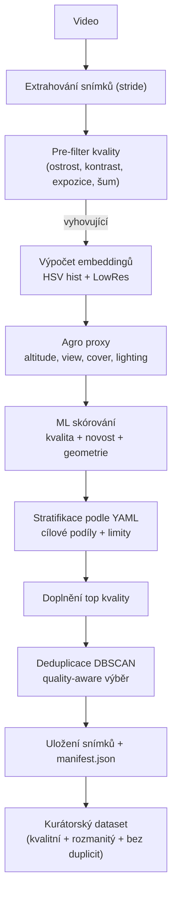

# Extract balanced frames from video to create a dataset for ML training

Tato aplikace slouží k **automatické kuraci snímků z droních videí** v agro doméně. Jejím cílem je připravit dataset, který je vhodný pro trénování modelů počítačového vidění – tedy **kvalitní, rozmanitý a bez duplicit**. Algoritmus nejprve odfiltruje rozmazané nebo nekvalitní snímky, spočítá embeddingy a agro-specifické proxy (výška letu, úhel pohledu, vegetační pokryv, světelné podmínky) a každému snímku přiřadí skóre. Následně vybírá reprezentativní sadu snímků podle definovaných **stratifikovaných podílů** a doplní je o nejlepší snímky z hlediska kvality. Na závěr provede deduplikaci pomocí shlukování, aby dataset neobsahoval zbytečné opakování téměř identických scén. Výsledkem je složka s vybranými snímky a manifestem (`manifest.json`) s metadaty, kterou lze využít pro další trénink ML modelů.

---

### Použití z CLI

```bash
pip install opencv-python numpy scikit-learn pyyaml
python ml_curation_agro.py input.mp4 -o curated_out \
  --config curation_config.agro.yaml \
  --stride 2 --target-size 600 \
  --min-sharpness 80 --min-contrast 20
```

* `input.mp4` – vstupní video
* `curated_out/` – výstupní složka se snímky a `manifest.json`
* `curation_config.agro.yaml` – YAML konfigurace s cílovými podíly a limity stratifikace

---

### Použití přes FastAPI

Spuštění serveru:

```bash
uvicorn fastapi_app_agro:app --reload --host 0.0.0.0 --port 8000
```

Dostupné endpointy:

* `GET /health` – kontrola běhu služby
* `GET /config` – vrátí načtenou YAML konfiguraci
* `POST /curate` – nahraje video, provede kuraci a vrátí manifest a seznam snímků
* `GET /download?path=/abs/cesta/k/zipu.zip` – stáhne ZIP se snímky (pokud bylo požadováno v `/curate`)

Příklad volání:

```bash
curl -X POST "http://localhost:8000/curate" \
  -F "file=@/path/to/video.mp4" \
  -F "stride=2" -F "target_size=600" \
  -F "return_zip=true"
```

---



## 📑 Algoritmus a workflow

1. **Pre-filtering snímků**

   * Video se rozdělí na snímky (s krokem `stride`).
   * Spočítají se rychlé metriky kvality (ostrost, kontrast, expozice, šum).
   * Do další fáze projdou jen snímky, které splní minimální prahy.

2. **Výpočet embeddingů a proxy**

   * Embedding = **HSV histogram + LowRes grayscale** (L2 norm).
   * Agro-specifické proxy:

     * **altitude proxy** (HF energie → low/mid/high),
     * **view proxy** (entropie orientací → nadir/oblique),
     * **cover proxy** (ExG → bare\_soil/crop\_sparse/crop\_dense),
     * **lighting proxy** (průměrná intenzita → dark/normal/bright).

3. **ML skórování snímků**

   * Kombinace: **kvalita** (ostrost/kontrast/expozice/šum) + **novost** (embedding vs. prototypy) + **geometrická diverzita** (orientace hran).
   * Výsledné skóre 0–1.

4. **Stratifikace**

   * Každý snímek je zařazen do kombinace čtyř os (altitude × view × cover × lighting).
   * YAML konfiguruje cílové podíly (např. 24 % „low|nadir|crop\_dense|normal“).
   * Selektor vybírá podreprezentované kombinace, dokud není dosažen cíl.

5. **Doplnění top kvality**

   * Pokud není naplněn `target_size`, doplní se nejlepší snímky podle ML skóre.

6. **Deduplicace (quality-aware)**

   * DBSCAN shlukuje embeddingy (cosine distance, eps z distribuce podobností).
   * Z každého clusteru se ponechá jen top-K (10 %) podle ML skóre.

7. **Výstup**

   * Vybrané snímky se uloží do složky.
   * Manifest (`manifest.json`) obsahuje metadata: index, čas, ML skóre, subscores, stratu a proxy hodnoty.
