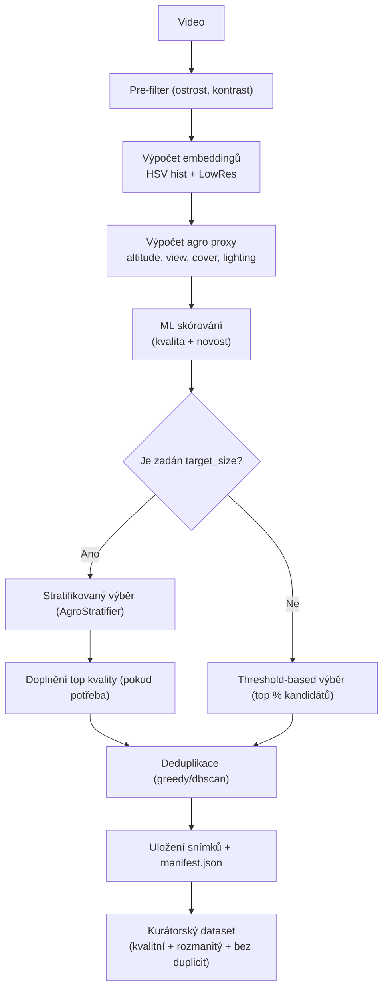

# Balanced Frame Extractor for Agro ML Datasets

Extract balanced frames from video to create a dataset for ML training.

Tato aplikace slouží k automatické kuraci snímků z droních videí v agro doméně. Cílem je připravit dataset vhodný pro trénování modelů počítačového vidění — tedy kvalitní, rozmanitý a bez duplicit. Skript provádí pre-filtraci podle kvality snímků, spočítá embeddingy a agro-proxy (výška letu, úhel pohledu, vegetační pokryv, světelné podmínky), skóruje snímky pomocí ML logiky, provede stratifikovaný výběr nebo threshold-based výběr a nakonec deduplikaci. Výstupem je složka s vybranými snímky a manifest (`manifest.json`) s metadaty.

---

## Shrnutí flow (odpovídá implementaci ve `balanced_frame_extractor.py`)

1. Prefilter snímků (ostrost, kontrast, stride)
2. Výpočet metrik kvality (exposure, noise) a embeddingů (HSV hist + lowres)
3. Výpočet agro-proxy (hf_energy / altitude proxy, view entropy, green cover, lighting mean)
4. ML skórování kandidátů (novelty + kvalita) — provádí `MLFrameScorer`
5. Stratifikace (pokud je zadán `--target-size`) nebo threshold-based selection (pokud `target_size` není zadán)
6. Deduplikace (metoda `greedy` nebo `dbscan`)
7. Uložení snímků + generace `manifest.json` (level-0: `input_video`, `run_params`, `task_summary`, `frames`)

Diagram (schematicky):



---

## Použití z CLI

Nejjednodušší příklad:

```bash
pip install opencv-python numpy scikit-learn pyyaml
python balanced_frame_extractor.py data/bike.mp4 -o curated_out --config config.yaml
```

Přesné CLI volby dostupné ve skriptu (`main()`):

- `video` (pozicní) — cesta ke vstupnímu videu
- `-o, --out` — výstupní adresář
- `--config` — cesta ke konfiguraci YAML
- `--stride` — vybírat každý N-tý snímek
- `--target-size` — cílový počet snímků (pokud je nastavena → použije se stratifikace)
- `--min-sharpness` — minimální ostrost (variance of Laplacian)
- `--min-contrast` — minimální kontrast
- `--novelty-threshold` — práh pro novost / prototypy (0..1)
- `--dedup-method` — `greedy` nebo `dbscan`
- `--manifest` — název manifest souboru
- `--debug` — zapnout debug logy

Ukázka s přepsáním parametrů přes CLI:

```bash
python balanced_frame_extractor.py input.mp4 -o curated_out_new \
  --config config.yaml \
  --target-size 100 --novelty-threshold 0.5 --dedup-method dbscan \
  --manifest curated_manifest.json --stride 2 --min-sharpness 90 --min-contrast 25
```

Poznámka: hodnoty ve `--config` (YAML) jsou použity jako `defaults` a `parser.set_defaults(**defaults)` v skriptu. Argumenty z CLI mají prioritu a jsou detekovány v `run_params` jako `source: "cli"`.

---

## Použití přes FastAPI

Projekt obsahuje `fastapi_app_agro.py`. Server se spouští například takto:

```bash
uvicorn fastapi_app_agro:app --reload --host 0.0.0.0 --port 8000
```

Endpointy (resp. očekávané based on repository structure):

- `GET /health` — kontrola běhu služby
- `GET /config` — vrátí načtenou YAML konfiguraci
- `POST /curate` — nahraje video, provede kuraci a vrátí manifest + seznam snímků (možnost `return_zip=true`)
- `GET /download?path=/abs/cesta/k/zipu.zip` — stáhne ZIP se snímky (pokud byl vytvořen)

Příklad volání `/curate`:

```bash
curl -X POST "http://localhost:8000/curate" \
  -F "file=@/path/to/video.mp4" \
  -F "stride=2" -F "target_size=600" \
  -F "return_zip=true"
```

---

## Struktura a klíče v YAML konfiguraci (používané ve skriptu)

Skript čte `config.yaml` a očekává, že v něm může být např. tato struktura (použité klíče):

- `defaults`: mapuje přímo na argumenty CLI (parser.set_defaults(**defaults))
  - např. `out`, `stride`, `target_size`, `min_sharpness`, `min_contrast`, `novelty_threshold`, `dedup_method`, `manifest`
- `output`:
  - `jpeg_quality` (integer)
  - `log_intervals`: `frames_processed`, `frames_saved`
- `proxies`:
  - `view_entropy_bins`
  - `green_cover_threshold`
- `selection`:
  - `threshold_selection_ratio` (použité když `target_size` není zadán)
- `deduplication`:
  - `method` (`greedy` / `dbscan`)
  - `cosine_threshold` (pro greedy)
  - `eps`, `min_samples` (pro dbscan)
- `stratification`:
  - `thresholds`: `view_entropy`, `cover_ratio`, `lighting_mean`

Vzor (útržek) `config.yaml`:

```yaml
defaults:
  stride: 1
  min_sharpness: 80.0
  min_contrast: 20.0
  novelty_threshold: 0.3
  dedup_method: greedy
  manifest: manifest.json

output:
  jpeg_quality: 95
  log_intervals:
    frames_processed: 1000
    frames_saved: 100

proxies:
  view_entropy_bins: 8
  green_cover_threshold: 0.6

selection:
  threshold_selection_ratio: 0.25

deduplication:
  method: greedy
  cosine_threshold: 0.85
  eps: 0.5
  min_samples: 1

stratification:
  thresholds:
    view_entropy: 1.8
    cover_ratio: 0.5
    lighting_mean: 115
```

---

## Vzorová struktura `manifest.json` (aktuální — level-0)

Manifest nyní používá jednoduchou level-0 strukturu bez duplicitních top-level polí. Hlavní klíče jsou: `input_video`, `run_params`, `task_summary`, `frames`.

```json
{
  "input_video": "/abs/path/to/video.mp4",
  "run_params": {
    "out": { "value": "data/output/video", "source": "derived" },
    "stride": { "value": 1, "source": "default" }
  },
  "task_summary": {
    "video": "video.mp4",
    "output_dir": "/abs/path/to/output",
    "candidates_count": 123,
    "selected_count": 100,
    "selection_ratio": "81.3%",
    "ml_score": {
      "average": "0.345",
      "median": "0.321",
      "range": "0.100 - 0.900"
    },
    "axes_summary": {
      "altitude": { "low": 10, "high": 90 },
      "view": { "low": 50, "high": 50 },
      "cover": { "low": 20, "high": 80 },
      "lighting": { "low": 40, "high": 60 }
    },
    "strata_distribution": {
      "altitude:low|view:low|cover:low|lighting:low": 10
    }
  },
  "frames": [
    {
      "saved_path": "/abs/path/to/output/frame_000000_src000123_t00012.345.jpg",
      "source_index": 123,
      "t_sec": 12.345,
      "ml_score": 0.912,
      "subscores": { "quality": 0.9, "novelty": 0.8 },
      "strata": ["low", "high", "low", "mid"],
      "sharpness": 123.4,
      "contrast": 23.1,
      "exposure_score": 0.12,
      "noise_score": 0.01,
      "hf_energy": 0.234,
      "view_entropy": 2.23,
      "green_cover": 0.67,
      "lighting_mean": 120.5
    }
  ]
}
```

---

## Known issues / nekonzistence (stav po úpravě)

Soubor `balanced_frame_extractor.py` byl upraven tak, aby odstranil duplicitní top-level pole v manifestu. Aktuální stav a drobné poznámky:

1. Manifest duplicity — vyřešeno:
   - Dřívější duplicita (`count_candidates`/`count_selected` na top-level vs `candidates_count`/`selected_count` v `task_summary`) byla odstraněna.
   - Manifest nyní používá level-0 strukturu: `input_video`, `run_params`, `task_summary`, `frames`. Agregační údaje (`axes_summary`, `strata_distribution`, počty) jsou umístěny pouze v `task_summary`.

2. Logging:
   - Komentář v `setup_logging()` zmiňuje rotaci logu, ale implementace aktuálně používá `logging.FileHandler` bez rotace.
   - Doporučení: pokud chcete rotaci logu, přepnout na `RotatingFileHandler` nebo `TimedRotatingFileHandler`.

3. Hardcoded kvantil pro altitude:
   - `assign_strata_to_frames()` počítá kvantil 0.5 (medián). To je validní výchozí, ale lze zvážit parametrizaci kvantilu přes konfiguraci.

4. `run_params` formát:
   - `run_params` ukládá pro každý parametr mapu `{"value": ..., "source": ...}`. To je záměrné, ale spotřebitelé manifestu by to měli vzít v úvahu.

Pokud chcete, mohu:

- Upravit `setup_logging()` na použití rotujícího handleru (ACT MODE), nebo
- Přidat konfigurační volbu pro altitude kvantil (ACT MODE).

---

## Doporučení pro další kroky (volitelné)

- Pokud chcete, mohu:
  - automaticky upravit kód a sjednotit názvy polí v manifestu (ACT MODE vyžadován), nebo
  - pouze upravit README (hotovo v této úpravě), nebo
  - přidat krátký test, který zkontroluje, že `manifest.json` má očekávaná pole.

---

## Často používané konfigurační klíče pro rychlou referenci

- `defaults` — mapování CLI výchozích
- `output.jpeg_quality`, `output.log_intervals.frames_processed`, `output.log_intervals.frames_saved`
- `proxies.view_entropy_bins`, `proxies.green_cover_threshold`
- `selection.threshold_selection_ratio`
- `deduplication.method`, `deduplication.cosine_threshold`, `deduplication.eps`, `deduplication.min_samples`
- `stratification.thresholds.view_entropy`, `stratification.thresholds.cover_ratio`, `stratification.thresholds.lighting_mean`

---

## Kontakt / poznámka

Tento README byl aktualizován, aby přesně odpovídal krokům a políčkům používaným v `balanced_frame_extractor.py`. Pokud chcete, aby README také obsahoval příklad `config.yaml` kompletně přizpůsobený vašemu projektu nebo chcete, abych provedl doporučené změny v kódu (např. sjednocení názvů v manifestu), přepněte do ACT MODE a potvrďte, které změny chcete provést.
