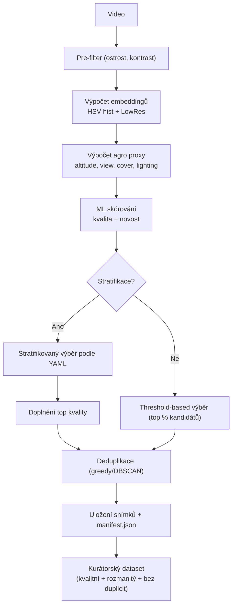

# Balanced Frame Extractor for Agro ML Datasets

Extract balanced frames from video to create a dataset for ML training.

Tato aplikace slouží k **automatické kuraci snímků z droních videí** v agro doméně. Jejím cílem je připravit dataset, který je vhodný pro trénování modelů počítačového vidění – tedy **kvalitní, rozmanitý a bez duplicit**. Algoritmus nejprve odfiltruje rozmazané nebo nekvalitní snímky, spočítá embeddingy a agro-specifické proxy (výška letu, úhel pohledu, vegetační pokryv, světelné podmínky) a každému snímku přiřadí skóre. Následně vybírá reprezentativní sadu snímků podle definovaných **stratifikovaných podílů** a doplní je o nejlepší snímky z hlediska kvality. Na závěr provede deduplikaci pomocí shlukování, aby dataset neobsahoval zbytečné opakování téměř identických scén. Výsledkem je složka s vybranými snímky a manifestem (`manifest.json`) s metadaty, kterou lze využít pro další trénink ML modelů.

---

### Použití z CLI

Všechny parametry lze konfigurovat v `config.yaml` v sekci `defaults`. Hodnoty zadané přes CLI mají vždy přednost.

```bash
pip install opencv-python numpy scikit-learn pyyaml

# Spuštění s konfigurací z YAML souboru
python balanced_frame_extractor.py input.mp4 --config config.yaml

# Přepsání konkrétních parametrů přes CLI
python balanced_frame_extractor.py input.mp4 -o curated_out_new \
  --config config.yaml \
  --target-size 100 --novelty-threshold 0.5
```

* `input.mp4` – vstupní video
* `--config config.yaml` – YAML konfigurace, která nyní obsahuje i výchozí hodnoty pro parametry jako `out`, `manifest`, `target_size`, `stride`, `min_sharpness`, `min_contrast` a `novelty_threshold`.
* Argumenty zadané v příkazové řádce (např. `-o curated_out_new`) přepíší výchozí hodnoty z YAML souboru.

---

### Použití přes FastAPI

Spuštění serveru:

```bash
uvicorn fastapi_app_agro:app --reload --host 0.0.0.0 --port 8000
```

Dostupné endpointy:

* `GET /health` – kontrola běhu služby
* `GET /config` – vrátí načtenou YAML konfiguraci
* `POST /curate` – nahraje video, provede kuraci a vrátí manifest a seznam snímků
* `GET /download?path=/abs/cesta/k/zipu.zip` – stáhne ZIP se snímky (pokud bylo požadováno v `/curate`)

Příklad volání:

```bash
curl -X POST "http://localhost:8000/curate" \
  -F "file=@/path/to/video.mp4" \
  -F "stride=2" -F "target_size=600" \
  -F "return_zip=true"
```

---



## 📑 Algoritmus a workflow

1. **Pre-filtering snímků**
   * Video se rozdělí na snímky (s krokem `stride`).
   * Spočítají se metriky kvality (ostrost, kontrast).
   * Do další fáze projdou jen snímky, které splní minimální prahy.

2. **Výpočet embeddingů a agro proxy**
   * Pro každý kandidát se spočítá embedding (**HSV histogram + LowRes grayscale**).
   * Zároveň se spočítají agro proxy:
     * **altitude** (HF energie),
     * **view** (entropie orientací),
     * **cover** (ExG),
     * **lighting** (průměrná intenzita).

3. **ML skórování**
   * Každému snímku je přiřazeno skóre na základě kvality a novosti (embedding vs. prototypy).

4. **Výběr snímků**
   * Pokud je zadán `target_size`, použije se **stratifikovaný výběr** podle YAML cílů (kombinace os altitude, view, cover, lighting).
   * Pokud není zadán `target_size`, vybere se top % kandidátů podle ML skóre (threshold-based selection).
   * Pokud je použit stratifikovaný výběr, doplní se nejlepší snímky podle ML skóre do požadovaného počtu.

5. **Deduplikace**
   * Deduplikace probíhá metodou greedy (výchozí) nebo DBSCAN (dle konfigurace/CLI).
   * Z každé skupiny podobných snímků zůstane jen nejlepší podle ML skóre.

6. **Uložení a manifest**
   * Vybrané snímky se uloží do složky.
   * Manifest (`manifest.json`) obsahuje metadata: index, čas, ML skóre, subscores, stratu a proxy hodnoty.

Výsledkem je dataset snímků, který je kvalitní, rozmanitý a bez duplicit.
